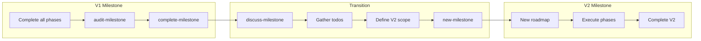
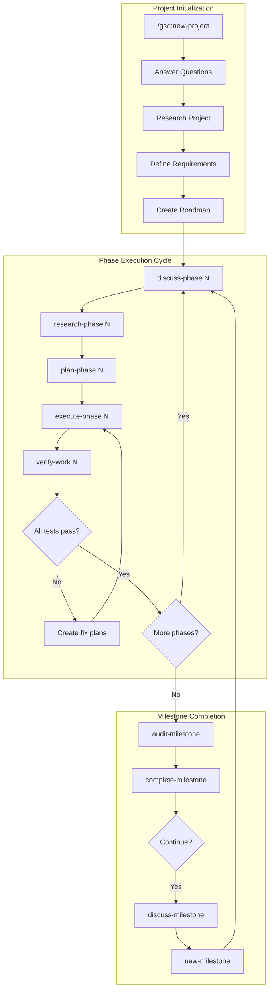
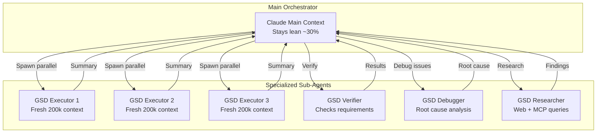
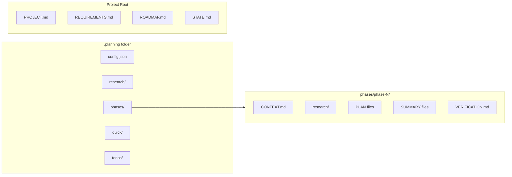
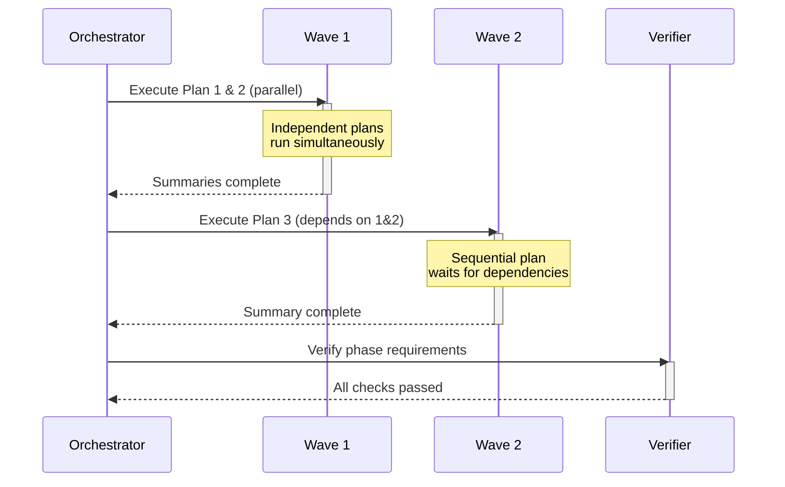

# GSD (Get Shit Done) - Complete Guide

A comprehensive guide to using GSD - the lightweight meta-prompting, context engineering, and spec-driven development system for Claude Code.

---

## Table of Contents

1. [What is GSD?](#what-is-gsd)
2. [Getting Started: Preparing Your Project Brief](#getting-started-preparing-your-project-brief)
3. [Installation](#installation)
4. [Command Cheatsheet](#command-cheatsheet)
5. [Step-by-Step Workflow Guide](#step-by-step-workflow-guide)
6. [Moving from V1 to V2 (and Beyond)](#moving-from-v1-to-v2-and-beyond)
7. [Best Practices Beyond Initial Scope](#best-practices-beyond-initial-scope)
8. [Workflow Diagrams](#workflow-diagrams)
9. [MCP Integration Guide](#mcp-integration-guide)
10. [Best Practices](#best-practices)
11. [Configuration](#configuration)
12. [Troubleshooting](#troubleshooting)
13. [Advanced Topics](#advanced-topics)
14. [Comparison with Other Tools](#comparison-with-other-tools)
15. [Glossary](#glossary)

---

## What is GSD?

GSD (Get Shit Done) is a **lightweight and powerful meta-prompting, context engineering, and spec-driven development system** for Claude Code, OpenCode, and Gemini CLI. Created by TÂCHES, it solves the critical problem of **context rot** - the quality degradation that happens as Claude fills its context window.

### Core Philosophy

> "I'm not a coder. I'm a high-level project manager. My job is to create systems that allow Claude to understand the code, plan, think, and verify as best as it can."
> — TÂCHES (GSD Creator)

### Key Features

| Feature | Description |
|---------|-------------|
| **Context Engineering** | Manages context efficiently through sub-agents with fresh 200k token windows |
| **Spec-Driven Development** | Creates requirements, roadmaps, and plans before execution |
| **Multi-Agent Orchestration** | Uses specialized sub-agents (executor, verifier, researcher, debugger) |
| **Atomic Git Commits** | Each task gets its own commit immediately after completion |
| **Parallel Execution** | Independent plans run simultaneously for maximum efficiency |
| **Goal-Backward Planning** | Plans based on "what must be true" rather than just "what to build" |

### How GSD Solves Context Rot

Without GSD, you might:
- Keep going and going until you hit the context window limit
- Scramble to make Claude remember what it needs to do
- Start strong but lose quality as the project progresses
- End up with code neither you nor Claude fully understands

With GSD:
- Every execution happens in a fresh sub-agent context (200k tokens)
- Main orchestrator stays lean (typically under 30% context usage)
- State is persisted in files, not in context memory
- You can complete entire phases while keeping context usage minimal

---

## Getting Started: Preparing Your Project Brief

Before running `/gsd:new-project`, prepare a brief describing your idea. This significantly reduces questions and improves results.

### What to Include in Your Brief

```markdown
# Project: [Name]

## Vision
[What are you building? Who is it for?]

## Key Features
- Feature 1: [description]
- Feature 2: [description]
- Feature 3: [description]

## Technical Preferences
- Platform: [Mac, Web, Mobile, etc.]
- Stack: [React, Swift, Python, etc.] (optional - can be researched)
- Constraints: [offline-first, no cloud, etc.]

## What's NOT in V1
- [Future feature 1]
- [Future feature 2]

## User Experience Goals
- [Easy setup - grandma should be able to use it]
- [Fast - no loading screens]
- [Beautiful - modern UI]
```

### Example Brief (from transcript)

```markdown
# Sample Digger

AI sample generation tool for musicians who don't want to think about AI.

## Key Features
- Generate AI samples locally (no internet required)
- Nice library UI like Loop Cloud
- Drag and drop directly into DAW
- Batch generate with same prompt
- Background generation (UI doesn't freeze)

## Technical
- Mac only for V1
- Use MusicGPT for generation
- FFmpeg for audio conversion
- Swift/SwiftUI

## What's NOT in V1
- Windows/Linux support
- Advanced BPM detection
- Multiple model sizes
```

**Result**: Claude asked only 4-5 clarifying questions instead of 15+ because the brief was detailed.

---

## Installation

### Quick Install

```bash
npx get-shit-done-cc
```

The installer prompts you to choose:
1. **Runtime** — Claude Code, OpenCode, Gemini, or all
2. **Location** — Global (all projects) or local (current project only)

### Non-Interactive Install (Docker, CI, Scripts)

```bash
# Claude Code
npx get-shit-done-cc --claude --global   # Install to ~/.claude/
npx get-shit-done-cc --claude --local    # Install to ./.claude/

# OpenCode
npx get-shit-done-cc --opencode --global # Install to ~/.config/opencode/

# Gemini CLI
npx get-shit-done-cc --gemini --global   # Install to ~/.gemini/

# All runtimes
npx get-shit-done-cc --all --global      # Install to all directories
```

### Staying Updated

GSD evolves rapidly. Update frequently:

```bash
npx get-shit-done-cc@latest
```

**Tip**: Update at least once a day when actively using GSD.

### Recommended: Skip Permissions Mode

For frictionless automation, run Claude Code with:

```bash
claude --dangerously-skip-permissions
```

This prevents stopping to approve common commands like `date`, `git commit`, etc.

---

## Command Cheatsheet

### Core Workflow Commands

| Command | Purpose |
|---------|---------|
| `/gsd:new-project` | Full initialization: questions → research → requirements → roadmap |
| `/gsd:discuss-phase [N]` | Capture implementation decisions before planning |
| `/gsd:plan-phase [N]` | Research + plan + verify for a phase |
| `/gsd:execute-phase <N>` | Execute all plans in parallel waves, verify when complete |
| `/gsd:verify-work [N]` | Manual user acceptance testing |
| `/gsd:audit-milestone` | Verify milestone achieved its definition of done |
| `/gsd:complete-milestone` | Archive milestone, tag release |
| `/gsd:new-milestone [name]` | Start next version: questions → research → requirements → roadmap |

### Navigation Commands

| Command | Purpose |
|---------|---------|
| `/gsd:progress` | Where am I? What's next? |
| `/gsd:help` | Show all commands and usage guide |
| `/gsd:update` | Update GSD with changelog preview |
| `/gsd:what's-new` | See changes between your version and latest |
| `/gsd:join-discord` | Join the GSD Discord community |

### Brownfield (Existing Projects)

| Command | Purpose |
|---------|---------|
| `/gsd:map-codebase` | Analyze existing codebase before new-project |

### Phase Management

| Command | Purpose |
|---------|---------|
| `/gsd:add-phase` | Append phase to roadmap |
| `/gsd:insert-phase [N]` | Insert urgent work between phases |
| `/gsd:remove-phase [N]` | Remove future phase, renumber |
| `/gsd:list-phase-assumptions [N]` | See Claude's intended approach before planning |
| `/gsd:plan-milestone-gaps` | Create phases to close gaps from audit |
| `/gsd:research-phase [N]` | Research before planning a phase (recommended) |

### Session Management

| Command | Purpose |
|---------|---------|
| `/gsd:pause-work` | Create handoff when stopping mid-phase |
| `/gsd:resume-work` | Restore from last session |

### Utility Commands

| Command | Purpose |
|---------|---------|
| `/gsd:settings` | Configure model profile and workflow agents |
| `/gsd:set-profile <profile>` | Switch model profile (quality/balanced/budget) |
| `/gsd:add-todo [desc]` | Capture idea for later |
| `/gsd:check-todos` | List pending todos |
| `/gsd:debug [desc]` | Systematic debugging with persistent state |
| `/gsd:quick` | Execute ad-hoc task with GSD guarantees |
| `/gsd:discuss-milestone` | Discuss next milestone scope before creating it |

### Claude Code Native Commands

| Command | Purpose |
|---------|---------|
| `/clear` | Clear context window (use after each phase) |
| `/compact` | Compress conversation context |
| `/cost` | Show token usage and costs |
| `/doctor` | Check Claude Code health |
| `/init` | Initialize CLAUDE.md in current directory |
| `/memory` | Edit CLAUDE.md memory file |
| `/model` | Switch AI model |
| `/permissions` | View/manage tool permissions |
| `/review` | Review changes since last commit |
| `/terminal-setup` | Configure terminal integration |
| `/vim` | Toggle vim keybindings |

---

## Step-by-Step Workflow Guide

### Phase 1: Project Initialization

#### For New (Greenfield) Projects

```
/gsd:new-project
```

1. **Answer Questions**: Claude asks until it understands your idea completely
   - Goals and constraints
   - Tech preferences
   - Edge cases
   
2. **Research Phase**: Spawns parallel agents to investigate the domain
   - Stack recommendations
   - Feature architecture
   - Potential pitfalls
   
3. **Define Requirements**: Creates explicit V1/V2 scope
   - What's in scope for this version
   - What's out of scope
   
4. **Create Roadmap**: Phases mapped to requirements

**Files Created**:
- `PROJECT.md` - Project vision (always loaded)
- `REQUIREMENTS.md` - Scoped requirements with phase traceability
- `ROADMAP.md` - Where you're going, what's done
- `STATE.md` - Decisions, blockers, memory across sessions
- `.planning/research/` - Ecosystem knowledge

#### For Existing (Brownfield) Projects

```
/gsd:map-codebase
```

Then run `/gsd:new-project` - it will incorporate the codebase analysis.

### Phase 2: Discuss Phase (Optional but Recommended)

```
/gsd:discuss-phase 1
```

**Purpose**: Capture your implementation preferences before planning.

The system identifies gray areas based on what's being built:
- **Visual features** → Layout, density, interactions, empty states
- **APIs/CLIs** → Response format, flags, error handling
- **Content systems** → Structure, tone, depth, flow

**Creates**: `{phase}-CONTEXT.md`

### Phase 3: Research Phase (Recommended)

```
/gsd:research-phase 1
```

**Purpose**: Deep dive into implementation specifics before planning.

- Uses web searches and MCP tools (like Context7)
- Investigates libraries, patterns, and best practices
- Creates research documents for the planner

**Creates**: `.planning/phases/{phase}/research/`

### Phase 4: Plan Phase

```
/gsd:plan-phase 1
```

The system:
1. **Reviews Research** - Uses research findings to inform planning
2. **Goal-Backward Planning** - Defines "what must be true" for success
3. **Creates Plans** - 2-3 atomic task plans with XML structure
4. **Verifies Plans** - Checks against requirements, loops until pass

**Creates**: `{phase}-RESEARCH.md`, `{phase}-{N}-PLAN.md`

### Phase 5: Execute Phase

```
/gsd:execute-phase 1
```

The system:
1. **Runs Plans in Waves** - Parallel where possible, sequential when dependent
2. **Fresh Context Per Plan** - 200k tokens purely for implementation
3. **Commits Per Task** - Every task gets atomic commits
4. **Verifies Against Goals** - Checks the codebase delivers phase promises

**Creates**: `{phase}-{N}-SUMMARY.md`, `{phase}-VERIFICATION.md`

### Phase 6: Verify Work

```
/gsd:verify-work 1
```

**Purpose**: Confirm features actually work as expected.

1. **Extracts Testable Deliverables** - What you should be able to do now
2. **Walks Through Each** - "Can you log in with email?" Yes/no
3. **Diagnoses Failures** - Spawns debug agents for root causes
4. **Creates Fix Plans** - Ready for immediate re-execution

**Creates**: `{phase}-UAT.md`, fix plans if issues found

### Phase 7: Complete the Loop

Repeat for each phase:
```
/gsd:discuss-phase 2
/gsd:plan-phase 2
/gsd:execute-phase 2
/gsd:verify-work 2
```

### Phase 8: Complete Milestone

```
/gsd:audit-milestone
/gsd:complete-milestone
```

- Archives the milestone
- Tags the release in git
- Prepares for next milestone

### Phase 9: Start Next Milestone

```
/gsd:discuss-milestone
/gsd:new-milestone
```

Same flow as `new-project` but for continuing development.

---

## Moving from V1 to V2 (and Beyond)

### The Milestone Lifecycle



### Step 1: Complete V1 Properly

Before moving to V2, ensure V1 is properly closed:

```bash
# Verify all phases are complete
/gsd:progress

# Audit the milestone (checks all verifications passed)
/gsd:audit-milestone

# Archive and tag the release
/gsd:complete-milestone
```

**What `complete-milestone` does**:
- Archives all V1 files to `.planning/milestones/v1/`
- Creates a git tag for the release
- Updates `PROJECT.md` with milestone status
- Prepares clean slate for V2

### Step 2: Gather Ideas for V2

Before creating V2, collect everything you want to add:

```bash
# Check your backlog
/gsd:check-todos

# Review what users/you found during V1
# - Bugs discovered during verify-work
# - Features you wished existed
# - UI/UX improvements noticed
```

### Step 3: Discuss the New Milestone

```bash
/gsd:discuss-milestone
```

Provide context for V2:
```
I want to implement:
1. All my pending todos
2. The UI improvements we discussed
3. Dark mode support
4. Performance optimizations

Also consider:
- What felt rough in V1?
- What's missing for production readiness?
```

**What happens**:
- Claude analyzes V1 codebase
- Reviews your todos
- Asks clarifying questions about V2 scope
- Creates `MILESTONE-CONTEXT.md`

### Step 4: Create the New Milestone

```bash
/gsd:new-milestone v2
```

**This follows the same flow as `new-project`**:
1. Questions (informed by V1 codebase)
2. Research (focused on V2 features)
3. Requirements (V2-specific)
4. Roadmap (new phases for V2)

**Key difference**: Claude already knows your codebase, so questions focus on new features, not foundational decisions.

### Step 5: Execute V2 Phases

Same workflow as V1:
```bash
/gsd:research-phase 1
/gsd:plan-phase 1
/gsd:execute-phase 1
/gsd:verify-work 1
/clear
# ... repeat for all V2 phases
```

---

## Best Practices Beyond Initial Scope

### Planning for Long-Term Projects

| Practice | Description |
|----------|-------------|
| **Use todos religiously** | Capture every idea during development |
| **Don't insert phases mid-milestone** | Finish what you started, add to next milestone |
| **Keep milestones focused** | 5-10 phases per milestone, not 50 |
| **Version your milestones** | V1, V2, V3... clear progression |
| **Archive properly** | Let `complete-milestone` handle archival |

### When to Create a New Milestone vs Add Phases

**Create NEW MILESTONE when**:
- V1 is complete and working
- You're adding a major feature set
- Scope is significantly different
- You want a clean git tag/release

**Add PHASES to current milestone when**:
- Fixing issues found during verification
- Small additions that fit current scope
- Bug fixes that block completion

```bash
# Add phase to current milestone
/gsd:add-phase "Polish UI transitions"

# Insert urgent fix between phases
/gsd:insert-phase 5 "Fix critical login bug"
```

### Managing Technical Debt Across Milestones

```bash
# During V1, capture debt as todos
/gsd:add-todo "Refactor authentication module"
/gsd:add-todo "Add proper error handling"
/gsd:add-todo "Write unit tests for core functions"

# In V2 discussion, include debt
/gsd:discuss-milestone
> "For V2, I want to address technical debt from my todos
> before adding new features"
```

### Recommended Milestone Cadence

| Milestone | Focus |
|-----------|-------|
| **V1** | Core functionality, MVP |
| **V2** | Polish, UX improvements, debt cleanup |
| **V3** | Advanced features, performance |
| **V4+** | User-requested features, scaling |

### Preserving Knowledge Across Milestones

**What persists**:
- `PROJECT.md` (updated with milestone history)
- `.planning/milestones/` (archived milestones)
- Git history (atomic commits from all milestones)
- Your expertise folders

**What resets**:
- `ROADMAP.md` (new phases for new milestone)
- `REQUIREMENTS.md` (new scope)
- `STATE.md` (fresh state)
- `.planning/phases/` (new phase structure)

### Multi-Milestone Project Structure

```
project/
├── PROJECT.md                    # Evolves with each milestone
├── ROADMAP.md                    # Current milestone only
├── REQUIREMENTS.md               # Current milestone only
├── STATE.md                      # Current state
├── .planning/
│   ├── config.json
│   ├── milestones/
│   │   ├── v1/                   # Archived V1
│   │   │   ├── ROADMAP.md
│   │   │   ├── REQUIREMENTS.md
│   │   │   └── phases/
│   │   └── v2/                   # Archived V2
│   │       └── ...
│   ├── phases/                   # Current milestone phases
│   └── todos/                    # Persistent backlog
└── src/                          # Your code
```

### Tips from Long-Running Projects

> "I use GSD to work on GSD. Each version is a milestone. I've done 300+ commits across multiple milestones." — TÂCHES

1. **Trust the archive**: Don't manually preserve files, let GSD handle it
2. **Review git log between milestones**: Great way to remember what was built
3. **Start each milestone fresh**: Clear context, fresh perspective
4. **Keep todos for "someday" features**: Not everything needs to be in the next milestone
5. **Celebrate milestone completion**: Each `complete-milestone` is a real release

---

### Quick Mode: Ad-Hoc Tasks

For tasks that don't need full planning:

```
/gsd:quick
> What do you want to do? "Add dark mode toggle to settings"
```

**Quick Mode provides**:
- Same GSD guarantees (atomic commits, state tracking)
- Planner + executor agents, same quality
- Skips optional steps (research, plan checker, verifier)
- Separate tracking in `.planning/quick/`

**Use for**: Bug fixes, small features, config changes, one-off tasks.

**Creates**: `.planning/quick/001-add-dark-mode-toggle/PLAN.md`, `SUMMARY.md`

---

### Todo Workflow: Backlog Management

Capture ideas without disrupting current work:

```bash
# Add todo during any phase
/gsd:add-todo "Add offline usage support"
/gsd:add-todo "Implement dark mode"

# Check todos later
/gsd:check-todos

# Implement todos in next milestone
/gsd:discuss-milestone
> "I want to implement my todos"
```

**Why use todos instead of insert-phase**:
- Keeps current roadmap stable
- Avoids mid-project scope creep
- Creates clean milestone boundaries
- Todos feed into next milestone planning

---

## Workflow Diagrams

### Main GSD Workflow



### Sub-Agent Orchestration Pattern



### File Structure Flow



### Execution Wave Pattern



---

## MCP Integration Guide

### What are MCPs?

MCP (Model Context Protocol) servers extend Claude Code's capabilities by providing:
- External tool access
- API integrations
- Specialized knowledge sources

### MCP Configuration Locations

| Location | Scope |
|----------|-------|
| `~/.claude/` | Global (all projects) |
| `./.claude/` | Local (current project only) |

### Popular MCPs for GSD Workflows

| MCP | Purpose | Use Case |
|-----|---------|----------|
| **Context7** | Documentation lookup | Research phases - finding library docs |
| **Browser Extension** | Web interaction | Testing web apps during verify-work |
| **File System** | File operations | Reading/writing project files |
| **Git** | Version control | Commit management |

### Setting Up MCPs

1. **Install MCP Server**:
```bash
# Example: Context7 MCP
npm install -g @context7/mcp-server
```

2. **Configure in Claude Settings**:
```json
// ~/.claude/settings.json
{
  "mcpServers": {
    "context7": {
      "command": "context7-mcp",
      "args": []
    }
  }
}
```

3. **Verify Installation**:
```
/gsd:help
```
MCPs should be available in research phases.

### How GSD Uses MCPs

During **research phases**, GSD:
1. Spawns research sub-agents
2. Sub-agents query MCPs for documentation
3. Results are compiled into research files
4. Research informs planning decisions

**Example Research Flow**:
```
/gsd:research-phase 1
→ Spawns 4 parallel researchers
→ Each queries Context7 for library docs
→ Web searches for best practices
→ Creates .planning/phases/1/research/
```

### MCP Best Practices

1. **Install Relevant MCPs Before Starting**: Have documentation MCPs ready for research phases
2. **Use Context7 for Library Research**: Especially for unfamiliar technologies
3. **Browser Extension for Testing**: Useful during verify-work for web apps
4. **Don't Overload**: Too many MCPs increase initial context

---

## Best Practices

### Context Management

| Practice | Why |
|----------|-----|
| **Always clear context between phases** | Fresh 200k tokens for each phase |
| **Use `/clear` after completing tasks** | Prevents context accumulation |
| **Monitor context usage** | Stay under 50% for best quality |
| **Let sub-agents do heavy lifting** | Main orchestrator stays lean |

### Planning Practices

| Practice | Why |
|----------|-----|
| **Never read planning files manually** | Let Claude handle them automatically |
| **Use comprehensive depth** | Better planning yields better results |
| **Research before planning each phase** | Informed plans are better plans |
| **Provide detailed initial briefs** | Reduces clarifying questions |

### Execution Practices

| Practice | Why |
|----------|-----|
| **Use YOLO mode** (`--dangerously-skip-permissions`) | Prevents interruption for common commands |
| **Don't deviate mid-milestone** | Complete milestones before adding features |
| **Use `/gsd:add-todo` for future features** | Avoids inserting phases mid-project |
| **Let verification catch issues** | Trust the system's verification agents |

### Workflow Practices

| Practice | Why |
|----------|-----|
| **Update GSD daily** | Rapid development, frequent improvements |
| **Start with `/gsd:map-codebase` for existing projects** | Gives Claude context about your code |
| **Use `/gsd:quick` for ad-hoc tasks** | Same guarantees without full planning |
| **Research ahead** | Research next phase while current executes |

### Git Practices

| Practice | Why |
|----------|-----|
| **Trust atomic commits** | Each task gets its own commit |
| **Don't manually commit during execution** | GSD handles all commits |
| **Review git log for progress** | Clear trail of completed work |

### From the Creator (TÂCHES)

> "I never read these files. I do the things Claude can't do on its own."

> "Taking extra steps - research project, define requirements, research phase before plan - yields much better results."

> "I try not to add phases mid-project. I use add-todo and implement in next milestone."

> "I use GSD to work on GSD. It's recursive but it works."

---

## Configuration

### Settings Location

GSD stores settings in `.planning/config.json`

### Core Settings

| Setting | Options | Default | Purpose |
|---------|---------|---------|---------|
| `mode` | `yolo`, `interactive` | `interactive` | Auto-approve vs confirm at each step |
| `depth` | `quick`, `standard`, `comprehensive` | `standard` | Planning thoroughness |

### Model Profiles

| Profile | Planning | Execution | Verification |
|---------|----------|-----------|--------------|
| `quality` | Opus | Opus | Sonnet |
| `balanced` | Opus | Sonnet | Sonnet |
| `budget` | Sonnet | Sonnet | Haiku |

Switch profiles:
```
/gsd:set-profile budget
```

### Workflow Agents

| Setting | Default | Purpose |
|---------|---------|---------|
| `workflow.research` | `true` | Research before planning each phase |
| `workflow.plan_check` | `true` | Verify plans before execution |
| `workflow.verifier` | `true` | Confirm deliverables after execution |

Override per-invocation:
- `/gsd:plan-phase --skip-research`
- `/gsd:plan-phase --skip-verify`

### Execution Settings

| Setting | Default | Purpose |
|---------|---------|---------|
| `parallelization.enabled` | `true` | Run independent plans simultaneously |
| `planning.commit_docs` | `true` | Track .planning/ in git |

### Git Branching Strategies

| Strategy | Description |
|----------|-------------|
| `none` | Commits to current branch (default) |
| `phase` | Creates branch per phase, merges at completion |
| `milestone` | Creates branch per milestone, merges at completion |

### Safety Hooks

GSD includes hooks to prevent dangerous operations:

**Block Dangerous Commands Hook**:
- Prevents accidental deletion of important files
- Blocks destructive git operations
- Stops rm -rf on critical directories

Located in: `~/.claude/hooks/` or `.claude/hooks/`

---

## Troubleshooting

### Commands Not Found

1. Restart Claude Code to reload slash commands
2. Verify files exist:
   - Global: `~/.claude/commands/gsd/`
   - Local: `./.claude/commands/gsd/`
3. Re-run installer: `npx get-shit-done-cc`

### Commands Not Working

1. Run `/gsd:help` to verify installation
2. Check for updates: `npx get-shit-done-cc@latest`
3. Clear context and try again: `/clear`

### Docker/Container Issues

If file reads fail with tilde paths:
```bash
CLAUDE_CONFIG_DIR=/home/youruser/.claude npx get-shit-done-cc --global
```

### Context Window Issues

1. Clear context frequently: `/clear`
2. Use `/compact` to compress conversation
3. Check usage with `/cost`
4. Let sub-agents handle heavy work

### Execution Failures

1. Check verification file: `{phase}-VERIFICATION.md`
2. Run `/gsd:verify-work N` for detailed testing
3. Use `/gsd:debug` for systematic debugging
4. Fix plans are auto-created for failures

### Uninstalling

```bash
# Global installs
npx get-shit-done-cc --claude --global --uninstall
npx get-shit-done-cc --opencode --global --uninstall

# Local installs
npx get-shit-done-cc --claude --local --uninstall
npx get-shit-done-cc --opencode --local --uninstall
```

---

## Quick Reference Card

### Minimal Workflow

```bash
# Install
npx get-shit-done-cc

# Start
claude --dangerously-skip-permissions
/gsd:new-project

# For each phase (repeat)
/gsd:research-phase N
/gsd:plan-phase N
/gsd:execute-phase N
/gsd:verify-work N
/clear

# Complete
/gsd:audit-milestone
/gsd:complete-milestone
```

### Essential Commands

```
/gsd:new-project      # Start new project
/gsd:plan-phase N     # Plan phase N
/gsd:execute-phase N  # Execute phase N
/gsd:progress         # Check status
/gsd:quick            # Ad-hoc task
/gsd:debug            # Debug issues
/clear                # Clear context
```

### File Locations

```
PROJECT.md            # Project vision
REQUIREMENTS.md       # What to build
ROADMAP.md           # Phases and status
STATE.md             # Current state
.planning/           # All planning artifacts
  config.json        # Settings
  research/          # Project research
  phases/            # Phase-specific files
  todos/             # Backlog items
```

---

## Advanced Topics

### Plan XML Structure

GSD creates plans using structured XML optimized for Claude:

```xml
<task type="auto">
  <name>Create login endpoint</name>
  <files>src/app/api/auth/login/route.ts</files>
  <action>
    Use jose for JWT (not jsonwebtoken - CommonJS issues).
    Validate credentials against users table.
    Return httpOnly cookie on success.
  </action>
  <verify>curl -X POST localhost:3000/api/auth/login returns 200 + Set-Cookie</verify>
  <done>Valid credentials return cookie, invalid return 401</done>
</task>
```

**Task Types**:
- `auto` - Fully automated execution
- `checkpoint` - Requires user verification before continuing

**Plan Front Matter**: Plans include YAML front matter that future Claudes can read without loading the entire file, keeping context lean.

### File Details and Size Limits

| File | Purpose | Size Guidance |
|------|---------|---------------|
| `PROJECT.md` | Project vision, always loaded | Keep concise |
| `REQUIREMENTS.md` | Scoped requirements with phase mapping | Complete list of V1/V2/out-of-scope |
| `ROADMAP.md` | Phases with status markers | Updated after each phase |
| `STATE.md` | Decisions table, blockers, current position | Memory across sessions |
| `CONTEXT.md` | Implementation decisions for a phase | Gray areas resolved |
| `PLAN.md` | Atomic task with XML structure | One plan per execution unit |
| `SUMMARY.md` | What happened, deviations, what changed | Created after execution |
| `VERIFICATION.md` | What must be true, pass/fail status | Created by verifier agent |

**Size limits are based on where Claude's quality degrades.** Stay under limits for consistent excellence.

### Expertise Folders

Create domain expertise folders for technologies you frequently use:

```
~/.claude/skills/expertise/
├── macos-apps/
│   └── best-practices.md
├── swift-ui/
│   └── patterns.md
└── react/
    └── conventions.md
```

Reference these during research phases:
```
/gsd:research-phase 1
(Then reference: "Also look at my SwiftUI expertise folder")
```

This teaches Claude your preferred patterns without repeating yourself.

### Using Alternative Models (Claude Code Router)

For budget-conscious usage or when rate-limited, use Claude Code Router to run any model in Claude Code:

```bash
# Install Claude Code Router
# Then run with alternative models:
ccr minimax     # Use Minimax model
ccr gemini      # Use Gemini
ccr gpt5        # Use GPT-5
```

**When to use alternatives**:
- Near usage limit (last 10-15% of session)
- Simple execution tasks
- Research phases (can use cheaper models)

**Note**: Some features like image sending may not work with all models.

### Parallel Research Optimization

While a phase executes, research the next phase:

```bash
# Terminal 1: Executing current phase
/gsd:execute-phase 5

# Terminal 2: Research next phase
/gsd:research-phase 6
```

This saves time without affecting execution quality.

### Token Usage Insights

From the creator's experience:
- **$200/month Max plan**: Typically hits usage limit 30 min before reset
- **$20 API credits**: Consumed in ~105 minutes of heavy GSD use
- **Opus 4.5 API cost**: ~$30,000/month equivalent at Max plan usage levels

**GSD's efficiency**: Despite heavy orchestration, sub-agents keep main context lean. A complete phase with multiple plans uses ~27% context while writing thousands of lines of code.

### Commit Message Format

GSD uses this commit format:
```
abc123f docs(08-02): complete user registration plan
def456g feat(08-02): add email confirmation flow
hij789k feat(08-02): implement password hashing
```

Format: `type(phase-plan): description`

Benefits:
- Git bisect finds exact failing task
- Each task independently revertable
- Clear history for future Claude sessions

---

## Comparison with Other Tools

| Feature | GSD | SpecKit | BMAD | Taskmaster |
|---------|-----|---------|------|------------|
| Context Management | Sub-agents | Manual | Manual | Manual |
| Parallel Execution | Yes | No | No | Limited |
| Verification Agents | Yes | No | No | No |
| Goal-Backward Planning | Yes | No | No | No |
| Atomic Commits | Yes | Varies | Varies | Varies |
| Enterprise Overhead | None | Some | High | Medium |

> "Other spec-driven development tools exist, but they make things way more complicated than they need to be. Sprint ceremonies, story points, stakeholder syncs, retrospectives, Jira workflows... I'm not a 50-person software company. I don't want to play enterprise theater."
> — TÂCHES

---

## Glossary

| Term | Definition |
|------|------------|
| **Context Rot** | Quality degradation as Claude's context window fills up |
| **Sub-Agent** | Fresh Claude instance spawned for specific tasks |
| **Orchestrator** | Main Claude context that coordinates sub-agents |
| **Phase** | A logical grouping of related tasks in the roadmap |
| **Plan** | An atomic unit of work with XML-structured tasks |
| **Milestone** | A complete version (V1, V2, etc.) comprising multiple phases |
| **Wave** | A group of parallel plans executed simultaneously |
| **Verification** | Automated check that requirements were met |
| **UAT** | User Acceptance Testing - manual verification by you |
| **Brownfield** | Existing project with code already written |
| **Greenfield** | New project starting from scratch |
| **YOLO Mode** | `--dangerously-skip-permissions` flag for frictionless automation |

---

## Resources

- **GitHub**: [github.com/glittercowboy/get-shit-done](https://github.com/glittercowboy/get-shit-done)
- **Discord**: `/gsd:join-discord`
- **Updates**: `npx get-shit-done-cc@latest`
- **Changelog**: Available in GitHub releases
- **Video Tutorial**: "I Created GSD For Claude Code. This Is How I Use It." on YouTube

---

*Guide generated from GSD documentation and creator's workflow demonstrations.*
*Last updated based on GSD v1.11+*
