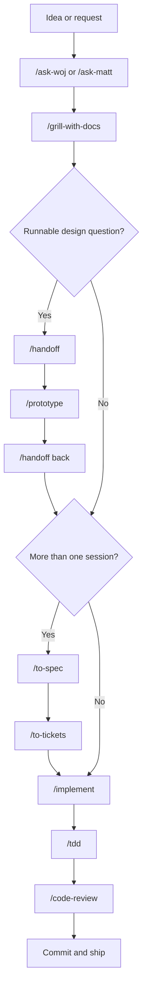
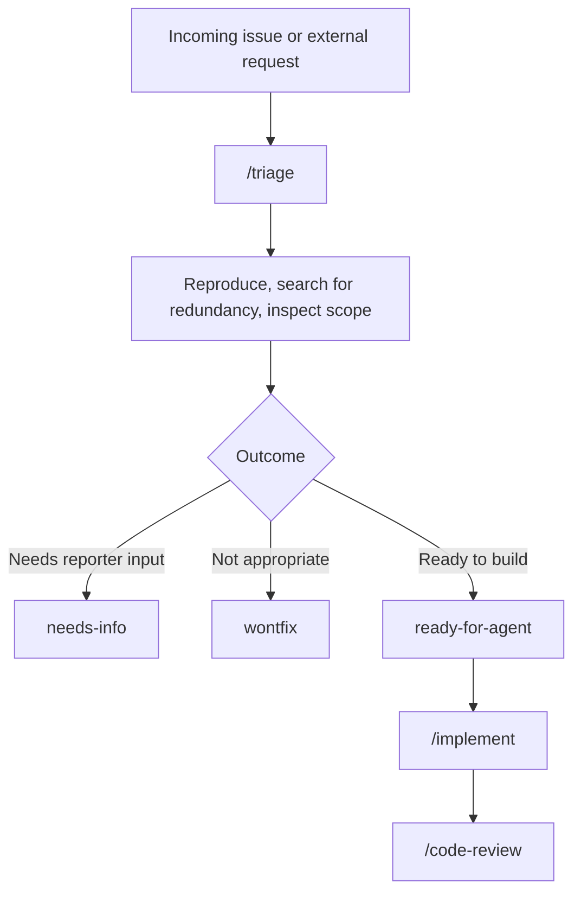
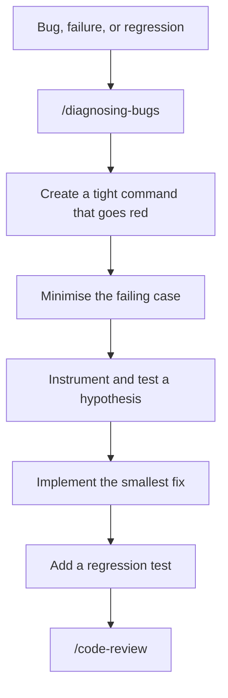
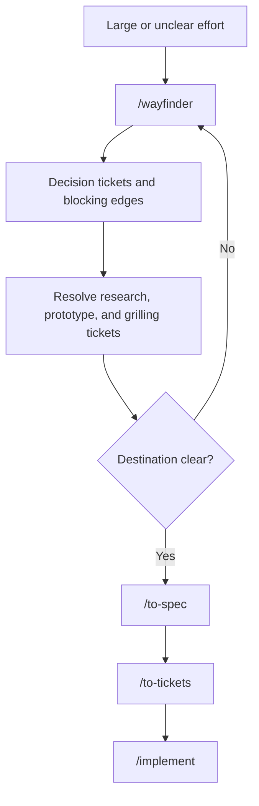
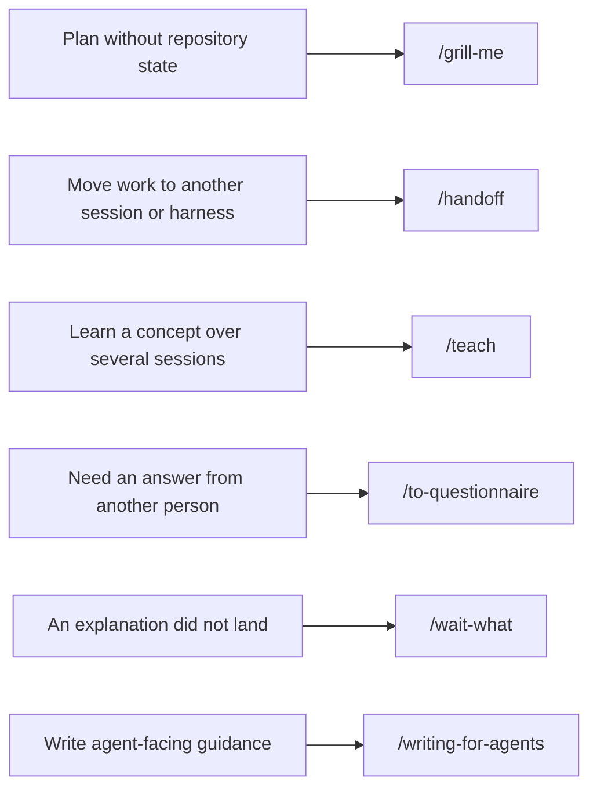
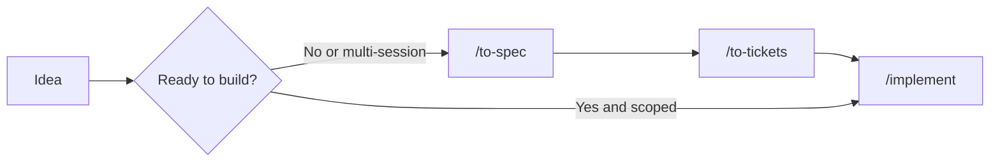
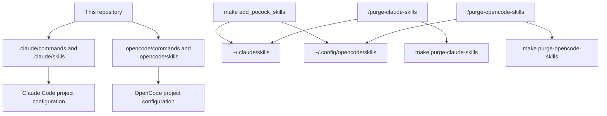

# Agent Skills Workflow

This repository carries the engineering and productivity skills from
[Matt Pocock's skills repository](https://github.com/mattpocock/skills),
adapted for this project's GitHub Issues, `AGENTS.md`, and `docs/agents/`
conventions.

The same skill set is available to Claude Code through `.claude/` and to
OpenCode through `.opencode/`. The local `/ask-woj` command is the project's
short router; `/ask-matt` is the upstream router.

## Main Build Flow

Use this flow when an idea needs to become shipped code.



Use `/grill-with-docs` when the repository should retain the glossary and
architectural decisions. Use `/grill-me` instead when the discussion is
stateless and does not belong to a repository.

## Incoming Issues

Triage is for work that arrived from outside the current planning flow. Do not
triage tickets already produced by `/to-tickets`.



The tracker and label vocabulary are defined in `docs/agents/issue-tracker.md`
and `docs/agents/triage-labels.md`.

## Hard Bugs

Use diagnosis when a bug resists a direct fix, is intermittent, or needs a
regression loop.



If diagnosis reveals that the code has no useful seam, continue with
`/improve-codebase-architecture` and `/codebase-design` before fixing the bug.

## Large or Foggy Work

Wayfinder is for efforts whose destination or decision order is not yet clear.
It produces decisions, not implementation commits.



Use `/improve-codebase-architecture` for a codebase-health scan when there is
no feature request yet. A chosen deepening opportunity becomes an idea for the
main build flow.

## Productivity Scenarios



These skills are user-invoked unless their skill metadata says otherwise. The
agent can use model-invoked skills such as `/grilling`, `/domain-modeling`,
`/codebase-design`, `/tdd`, and `/research` when the request matches their
triggers.

## `/implement` vs `/to-spec`

These commands are different phases, not interchangeable implementation
styles:

| Command | Purpose | Writes code? | Best fit |
| --- | --- | ---: | --- |
| `/to-spec` | Turn the conversation into a buildable product and engineering spec, then publish it to GitHub Issues. | No | Work that needs shared agreement or multiple sessions |
| `/implement` | Build an approved spec or set of tickets, using TDD where appropriate, validation, review, and a commit. | Yes | A scoped piece of work that is ready to build |

Typical sequence:



Use `/to-spec` when the problem, user stories, implementation decisions, or
testing decisions still need to be captured. Use `/implement` when those
decisions already exist in a spec, tickets, or a sufficiently precise request.

## Command Reference

The project commands and skills below are available in both Claude Code and
OpenCode. Claude Code reads `.claude/commands/` and `.claude/skills/`; OpenCode
reads `.opencode/commands/` and `.opencode/skills/`.

| Slash command | OpenCode | Claude Code | What it does |
| --- | --- | --- | --- |
| `/ask-woj` | Command | Command | Routes a situation to the best local workflow. |
| `/ask-matt` | Skill | Skill | Routes a situation through the complete upstream workflow map. |
| `/grill-with-docs` | Command and skill | Command and skill | Interviews about an idea while maintaining `_CONTEXT_<feature>.md`, `_INTERVIEW_<feature>.md`, and ADRs. |
| `/grill-me` | Skill | Skill | Interviews about a plan without writing repository context. |
| `/grilling` | Skill | Skill | Runs the reusable interview primitive. |
| `/prototype` | Skill | Skill | Answers a design question with throwaway code or UI. |
| `/handoff` | Skill | Skill | Writes portable context for another session, harness, or person. |
| `/teach` | Skill | Skill | Teaches a concept across multiple sessions. |
| `/to-questionnaire` | Command and skill | Skill | Captures questions that require another person's decision. |
| `/wait-what` | Skill | Skill | Re-explains a message that did not land. |
| `/to-spec` | Command and skill | Command and skill | Converts a conversation into a GitHub Issue specification. |
| `/to-tickets` | Command and skill | Command and skill | Splits a spec into tracer-bullet tickets with blocking edges. |
| `/wayfinder` | Command and skill | Command and skill | Maps decisions for a large or unclear effort. |
| `/triage` | Command and skill | Command and skill | Moves incoming GitHub Issues through triage states. |
| `/diagnosing-bugs` | Skill | Skill | Builds a tight feedback loop, finds the cause, and regression-tests it. |
| `/tdd` | Skill | Skill | Drives red-green-refactor development at agreed seams. |
| `/implement` | Command and skill | Command and skill | Builds ready work, validates it, reviews it, and commits it. |
| `/code-review` | Skill | Skill | Reviews a diff on Standards and Spec axes. |
| `/codebase-design` | Skill | Skill | Provides deep-module, interface, seam, and adapter vocabulary. |
| `/domain-modeling` | Skill | Skill | Sharpens domain terms and records durable decisions. |
| `/improve-codebase-architecture` | Command and skill | Command and skill | Finds deepening opportunities in the codebase. |
| `/research` | Skill | Skill | Investigates primary sources and writes cited findings. |
| `/resolving-merge-conflicts` | Skill | Skill | Resolves merge or rebase conflicts by intent. |
| `/wizard` | Skill | Skill | Creates a repeatable human-in-the-loop setup script. |
| `/writing-for-agents` | Skill | Skill | Guides the creation of agent-facing docs and skills. |
| `/setup-matt-pocock-skills` | Skill | Skill | Configures tracker, labels, and domain-doc conventions. |
| `/commit` | Command | Command | Generates a commit command from staged changes without running it. |
| `/pr` | Command | Command | Generates `_PR_<feature>.md` from the diff and PR structure. |
| `/purge-claude-skills` | Command | Command | Removes global Claude skills while preserving other Claude config. |
| `/purge-opencode-skills` | Command | Command | Removes global OpenCode skills while preserving other OpenCode config. |

Commands with both labels use a command adapter plus the corresponding skill;
the behavior is intentionally kept aligned across both harnesses.

## Claude Code and OpenCode



OpenCode prompt navigation is configured in `.opencode/tui.json`: Home and End
move within the current input line, while Ctrl+Home and Ctrl+End move across
the whole input buffer. The same bindings are used for selection and dialogs.

Project configuration is versioned with this repository. Global installation
is optional and uses symlinks to a cached checkout of the upstream skills.
`make delete_pocock_skills` removes only those links and its private cache.

The purge commands are intentionally broader than the Pocock delete target:
they remove every child of the selected global `skills/` directory, including
unrelated skills, while preserving the parent configuration directory. They
fail before deleting anything when the selected `skills/` directory is missing
or is a symlink.

## Mermaid Tooling

Mermaid validation is pinned in `.tool-versions`:

```text
node 24.16.0
npm:@mermaid-js/mermaid-cli 11.15.0
```

Install the CLI with `make mermaid-install` and validate every diagram with
`make mermaid-check`. The validator uses an installed Chromium or Google Chrome
binary and skips Puppeteer's separate browser download.

## Quick Reference

| Situation | Start with | Next step |
| --- | --- | --- |
| New idea in a repository | `/grill-with-docs` | `/implement` or `/to-spec` |
| New idea without repository state | `/grill-me` | `/to-spec` or `/implement` |
| Incoming issue | `/triage` | `/implement` when ready |
| Hard bug | `/diagnosing-bugs` | Regression test and `/code-review` |
| Large unclear effort | `/wayfinder` | `/to-spec` after decisions land |
| Need a visual design answer | `/prototype` | `/handoff` the result back |
| Need to move context | `/handoff` | Resume from the handoff document |
| Need to purge Claude global skills | `/purge-claude-skills` | Runs the Makefile safety checks |
| Need to purge OpenCode global skills | `/purge-opencode-skills` | Runs the Makefile safety checks |
